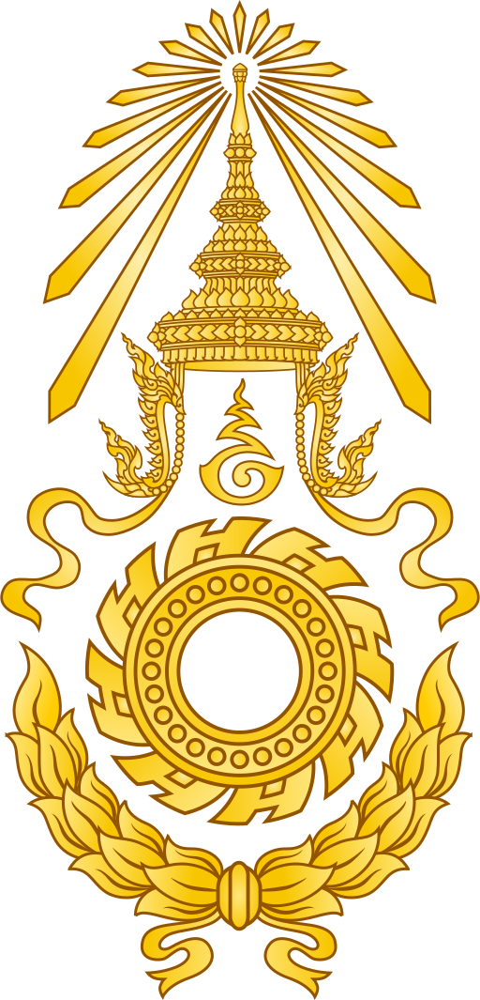

# คำถามที่พบบ่อย (FAQ)

## ทั่วไป

**Q: RTAphone คืออะไร?**
A: แอปโทรศัพท์ผ่าน Internet สำหรับกำลังพลกองทัพบก ใช้หมายเลข 5 ตัวทบ.

**Q: ใช้งานได้บน iPhone ไหม?**
A: ปัจจุบันรองรับเฉพาะ Android 9.0 ขึ้นไป

**Q: ใช้ผ่าน Wi-Fi ได้ไหม?**
A: ได้ ใช้ผ่าน Wi-Fi หรือ Mobile Data ได้ทั้งคู่

**Q: เสียค่าใช้จ่ายไหม?**
A: ไม่เสียค่าแอป ใช้ Internet Data ประมาณ 1 MB/นาที

## บัญชีผู้ใช้

**Q: ขอบัญชีได้ที่ไหน?**
A: ติดต่อแผนกเครือข่ายภายใน กองการสื่อสาร ศูนย์โทรคมนาคมและเทคโนโลยีสารสนเทศ กรมการทหารสื่อสาร กองทัพบก

**Q: ลืมรหัสผ่าน?**
A: ติดต่อแผนกเครือข่ายภายในเพื่อรีเซ็ต

**Q: ใช้หลายเครื่องได้ไหม?**
A: ได้ สายเรียกเข้าจะดังทุกเครื่องที่ล็อกอินอยู่

## การใช้งาน

**Q: โทรหาเบอร์มือถือได้ไหม?**
A: ขึ้นอยู่กับการตั้งค่าชุมสาย สอบถามแผนกเครือข่ายภายใน

**Q: แอปกินแบตเตอรี่มากไหม?**
A: ใช้แบตเตอรี่เล็กน้อยจาก Keep Alive Service

**Q: สนทนาถูกดักฟังได้ไหม?**
A: RTAphone ใช้ TLS + SRTP เข้ารหัส ทำให้ดักฟังได้ยากมาก

---

## ติดต่อสอบถาม
**แผนกเครือข่ายภายใน**
กองการสื่อสาร ศูนย์โทรคมนาคมและเทคโนโลยีสารสนเทศ
กรมการทหารสื่อสาร กองทัพบก

---
[กลับไปสารบัญ](README.md) | [ก่อนหน้า: การแก้ไขปัญหา](07-troubleshooting.md)
